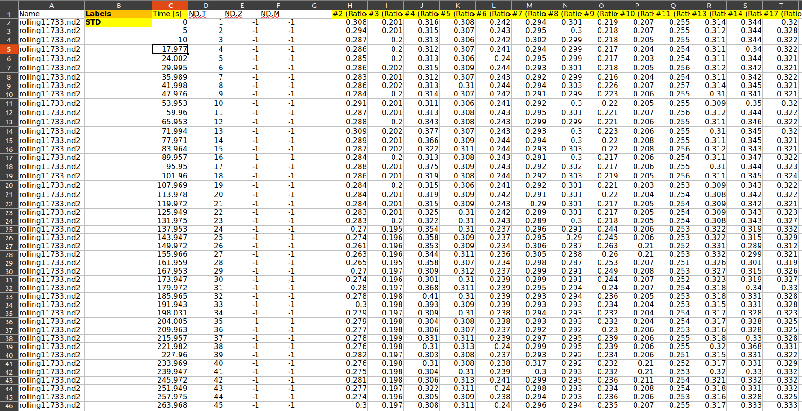

# Calcium File Conversion

`calcium_converter.py` is a python script that converts a calcium imaging file
generated from `<insert name here>`.

## Setup

To use the script, you must have python 3 installed. Also, `openpyxl` must be
installed (`pip instal openpyxl`).

## Usage

To see help information about the script, run `python calcium_converter.py -h`.
This generates the following:

```
$ python3 calcium_converter.py -h
usage: calcium_converter.py [-h] [-base BASE] [-peak PEAK]
                            [--post-std-time-to-search POST_STD_TIME_TO_SEARCH]
                            file

positional arguments:
  file                  Calcium file to convert. Must be an xlsx
                        file with a name of the form
                        XXXX_XX_XX_Y.xlsx, where XXXX_XX_XX is a
                        date and Y is a run label.
optional arguments:
  -h, --help            show this help message and exit
  -base BASE            Number of cycles before drug application
  -peak PEAK            Enter (1) if you want to calculate the
                        PEAK using the highest value,(2) if using
                        the average of three
  --post-std-time-to-search POST_STD_TIME_TO_SEARCH
                        Number of seconds after treatment applied
                        to search for a peak
```

The script requires a `file`. The rest of the arguments are optional. To run the
script without any other arguments, run `python calcium_converter.py
<filename>`, where `<filename>` is a valid calicum imaging file. The script will
generate another file named `<filename>_analysis.xlsx` that will contain the
converted data with various calculations listed.

## Format of the calcium imaging file.

The imaging file assumes that row headers are located in the first row. Headers
that must be present are as follows:
* A header that has "Time" in it. This expected to be a column of time stamps
  with units of seconds. There must be no blank cells in this column.
* A header that has "Labels" in it. This is expected to be a mostly blank column
  that has treatment labels at the start of certain treatment periods. **When
  classifying treatment type, use the label `STD` or `Standard Bath` to indicate
  the treatment portion where the cell was washed.** When generating region
  labels for the new data, the first number encountered in each of the treatment
  label headers will be used as the label. If no number is encountered, an
  arbitrary label number will be applied. For example, if the label is named #17
  (Ratio 340/380), the new treatment label will be given a value of 17.
* Any number of headers with the word "Ratio" in them. These headers correspond
  to columns of ratio data. These columns are converted into calcium
  concentration values using the equation `concentration = 146 * (25813.79 /
  1674.68) * ((ratio - 0.132) / (6.274 - ratio))`. **All ratio columns must be
  adjacent to each other.** All ratio data columns are expected to not have
  blank values. All ratio data columns are expected to be comprised of purely
  floats or integers (no strings or other data types). The script will inform
  you if any of these conditions are not met.
* Additional headers will be ignored by the script.

See the image below for a well formatted calcium converter file.



### Treatment data

The first treatment label must be "STD" or "Standard Bath". This is required to
properly compute the base before a treatment is applied. There are a number of
possible senarios that are handled by this script in terms of treatment type
ordering.

1. A standard bath treatment comes directly before and after the treatment. In
   this case, the base will be computed using the prior standard bath treatment
   and the area and peak will be computed using the treatment data as well as
   the anterior standard bath treatment.
2. A non-standard bath treatment comes before the treatment. In this case, the
   closest standard bath treatment will be used to compute the base.
3. A non-standard bath treatment comes after the treatment. In this case, the
   area and peak will be computed using only the treatment data and will not
   include the anterior treatment.
